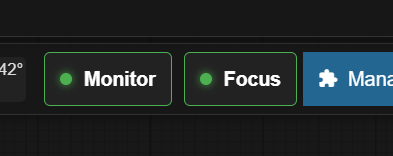

# HALXP-Comfy (ComfyUI Extension)

 

**HALXP-Comfy** is a professional UX suite for ComfyUI designed to enhance workflow management.




This extension is the starting point for a growing collection of tools. Currently, it features **HALXP Focus**, a way to auto-focus the current running node, **HALXP RunMonitor** that lets you run a script on success or error, and **Pretty JSON Export** for human-readable workflow files, with more enhancements currently in development.

**Verified working on:** Legacy UI, ComfyUI V1 (Nodes 2.0), and Portable Distributions.

## ⚠️ Prerequisite
**This extension requires [ComfyUI Manager](https://github.com/ltdrdata/ComfyUI-Manager) to be installed.**
The HALXP UI elements are designed to dock seamlessly alongside the ComfyUI Manager button in the main menu.

## 🌟 Features

### 1. HALXP Focus
A smart "Focus" button injected into your main menu bar.
* **Auto-Follow:** Smoothly pans the camera to the currently executing node, allowing you to watch your workflow progress hands-free.
* **Smart Docking:** Automatically detects the ComfyUI Manager button and injects itself seamlessly beside it.
* **Visual Feedback:** Features a status indicator (Green dot = Active) so you always know when auto-follow is engaged.
* **V1 Compatible:** Works natively with the new Vue.js frontend and PrimeVue menus.

### 2. HALXP RunMonitor
A way to run a custom script on workflow success or failure
* Go in the Settings under HALXP-Comfy and set a batch file to run or anything you want 
* (play a wav, open a website, etc.) separately for success and errors - doesn't cover static validation error on launch
* ex: With my phone provider (Free Mobile in France), I have an API to send SMS so I can go do other things and get notified when my workflow ends
* batch file content example: 
* start "" "https://smsapi.free-mobile.fr/sendmsg?user=XXXXXXXXXX&pass=YYYYYYYYYYY&msg=Comfy%%20Error%%20!"
* **Smart Docking:** Automatically detects the ComfyUI Manager button and injects itself seamlessly beside it.
* **Visual Feedback:** Features a status indicator (Green dot = Active) so you always know when Monitor is engaged.
* **V1 Compatible:** Works natively with the new Vue.js frontend and PrimeVue menus.

### 3. Pretty JSON Export
Makes workflow JSON exports human-readable with proper indentation for easier version control diffs.
* **Automatic formatting:** All workflow saves and exports are automatically pretty-printed with 2-space indentation
* **No configuration needed:** Works out of the box
* **Manual export functions:** Available in browser console:
  - `exportPrettyWorkflow()` - exports the visual workflow JSON
  - `exportPrettyApiWorkflow()` - exports the API format JSON
* **Version control friendly:** Makes git diffs readable and reviewable
* **Customizable indentation:** Edit `js/pretty_json.js` to change indent size if needed

### 4. More Coming Soon
HALXP is built as a modular suite. Expect future updates to include additional layout and debugging tools to further improve your ComfyUI experience.

## 📦 Installation

### Via ComfyUI Manager (Recommended)
1. Open ComfyUI Manager.
2. Search for `HALXP-Comfy`.
3. Install and Restart.

### Manual Installation
1. Navigate to your `ComfyUI/custom_nodes/` directory.
2. Clone this repository:
   ```bash
   git clone [https://github.com/HAL-XP/halxp-comfyui](https://github.com/HAL-XP/halxp-comfyui)